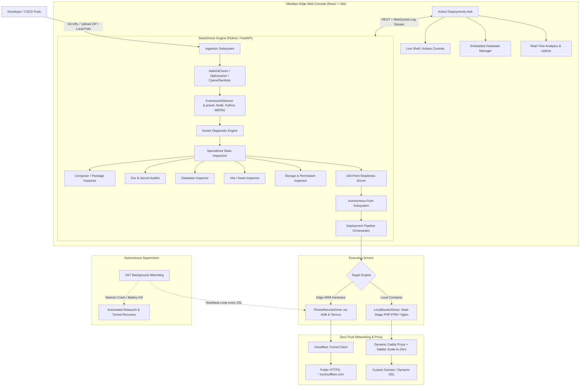

# 🩺 StackDoctor

<p align="center">
  <strong>Autonomous Edge Cloud Orchestrator & Full-Stack Deployment Health Platform</strong>
</p>

  <a href="https://github.com/yashpadaliya08/StackDoctor/actions/workflows/ci.yml"></a>
  
  
  
  
  
  
  
  
  <a href="LICENSE"></a>
</p>

---

## 📖 Overview

**StackDoctor** is an autonomous, full-stack edge cloud deployment platform and diagnostic health engine designed for polyglot web applications (**Laravel, Node.js Express, Python FastAPI/Flask, MERN**).

Instead of dealing with broken `.env` secrets, missing database drivers, unbuilt Vite assets, file permission errors, or paying for costly cloud virtual machines, StackDoctor automates the entire software delivery lifecycle:

1. **Ingestion**: Ingests codebases from Git repositories, local directories, ZIP archives, or cPanel backups.
2. **Deterministic Diagnostics**: Runs 7+ static code analyzers to compute a **100-Point Deployment Readiness Score**.
3. **Autonomous Auto-Repair**: Generates cryptographic application keys, synthesizes missing `.env` templates, provisions SQLite/MariaDB databases, builds Vite assets, symlinks storage, and caches routes.
4. **Edge & Container Deployment**: Deploys applications to local **Multi-stage Docker containers** or directly onto **Android ARM edge hardware** via ADB & Termux for zero-cost bare-metal compute.
5. **Zero-Trust Networking**: Automatically provisions **Cloudflare Tunnels** (`*.trycloudflare.com`) with instant public HTTPS and dynamic Caddy reverse proxy routing.
6. **24/7 Self-Healing Watchdog**: Actively monitors deployments with automated process revive and tunnel recovery upon process crashes or mobile OS battery-saver kills.

---

## 🏗️ High-Level System Architecture



---

## ✨ Key Features

- **🔍 100-Point Diagnostic Engine (`doctor/engine.py`)**  
  Static inspection verifying framework version compatibility, missing PHP/Node extensions, insecure `APP_DEBUG`, invalid `APP_KEY`, missing `public/build/manifest.json`, and database connectivity bridges.
- **⚡ Autonomous Auto-Repair Engine (`doctor/fixer.py`)**  
  Zero-click remediation: synthesizes `.env`, creates SQLite databases with proper permissions, repairs Docker bridge hostnames, creates symlinks, and executes production optimizations.
- **📱 Android ARM Edge Compute (`PhoneRemoteDriver`)**  
  Transforms spare Android smartphones into low-power, zero-cost bare-metal Linux servers over ADB and Termux with isolated high-port routing.
- **🐳 Multi-Stage Production Docker (`LocalDockerDriver`)**  
  Two-stage Dockerfile architecture separating fast frontend compilation (`node:20-alpine`) from lean production runtime (`php:8.3-fpm-nginx` / Node).
- **🌐 Instant Cloudflare Zero-Trust Tunnels**  
  Exposes edge applications via public HTTPS (`https://*.trycloudflare.com`) with zero open ports, no port-forwarding, and automated SSL.
- **⏱️ Sablier Scale-to-Zero & Dynamic Caddy Proxy**  
  Suspends idle containers after 15 minutes of inactivity and wakes them on incoming HTTP requests in under 2 seconds.
- **🛡️ 24/7 Self-Healing Watchdog (`watchdog.py`)**  
  Background supervisor checking deployment sockets every 25 seconds; restarts dead services and reconnects tunnels automatically.
- **💻 Obsidian Cyber-Prism Web Console (`web/`)**  
  Modern dark-mode dashboard featuring real-time log streaming, live Artisan/shell execution drawer, embedded database table explorer, and APM telemetry.

---

## 🚀 Quick Start Guide

### Prerequisites
- **Python**: `>= 3.10`
- **Node.js**: `>= 18.x` and `npm`
- **Git** installed and available in PATH
- *(Optional for Edge Phone Hosting)*: Android device with USB/Wireless Debugging enabled & Termux installed
- *(Optional for Container Hosting)*: Docker Desktop / Docker Engine

---

### 1. Installation

```bash
# Clone the repository
git clone https://github.com/yashpadaliya08/StackDoctor.git
cd StackDoctor

# Create and activate Python virtual environment
python -m venv venv
# Windows (PowerShell):
.\venv\Scripts\Activate.ps1
# Linux / macOS:
source venv/bin/activate

# Install backend dependencies & CLI tools
pip install -r requirements.txt
pip install -e .

# Configure Environment Variables & Secrets
# Windows:
copy .env.example .env
# Linux / macOS:
# cp .env.example .env

# Install frontend dependencies
cd web
npm install
cd ..
```

---

### 2. Launching StackDoctor

#### Option A: One-Click Launcher (Windows)
Double-click `start_stackdoctor.bat` or run:
```cmd
start_stackdoctor.bat
```

#### Option B: Manual Launch (Two Terminals)

**Terminal 1 — Backend API Server:**
```bash
python -m uvicorn server.main:app --host 127.0.0.1 --port 8000 --reload
```

**Terminal 2 — Frontend Dashboard:**
```bash
cd web
npm run dev -- --host 127.0.0.1 --port 5173
```

- **Dashboard UI**: [http://127.0.0.1:5173/](http://127.0.0.1:5173/)
- **Interactive API Documentation (Swagger)**: [http://127.0.0.1:8000/docs](http://127.0.0.1:8000/docs)

---

## 🛠️ CLI Usage (`laravel-doctor` / `doctor`)

StackDoctor provides a dedicated CLI tool for local project inspection and fixing:

```bash
# Scan a local project directory
doctor scan /path/to/laravel-project

# Scan an uploaded ZIP archive
doctor scan ./my-app.zip

# Scan a remote Git repository
doctor scan https://github.com/user/laravel-app.git

# Automatically apply recommended fixes
doctor fix /path/to/laravel-project

# Generate a detailed JSON report
doctor scan /path/to/laravel-project --format json
```

---

## 🌐 Edge Device Setup (Android / Termux)

To utilize an Android device as an ARM edge server:

1. **Enable USB / Wireless Debugging** on your Android device (under Developer Options).
2. Connect the phone to your host machine via USB or Wi-Fi. Verify ADB connection:
   ```bash
   adb devices
   ```
3. In Termux on the device, ensure OpenSSH is installed and running:
   ```bash
   pkg update && pkg install openssh php nodejs mariadb
   sshd
   ```
4. Set device connection details via environment variables or the Web Dashboard:
   ```bash
   export PHONE_HOST="127.0.0.1"       # or local network IP
   export PHONE_PORT="8022"            # Termux SSH default
   export PHONE_USER="termux_user"
   export PHONE_PASSWORD="device_password"
   ```
5. Deploy any project via the StackDoctor UI by selecting **Target: Phone (ARM)**.

---

## ⚙️ Environment Configuration

StackDoctor uses sensible defaults and environment variables for customized operation:

| Variable | Default | Description |
| :--- | :--- | :--- |
| `STACKDOCTOR_HOST` | `127.0.0.1` | Backend host binding |
| `STACKDOCTOR_PORT` | `8000` | Backend port |
| `OPERATOR_TOKEN` | *(auto-generated)* | Token for privileged shell and container management APIs |
| `PHONE_HOST` | `127.0.0.1` | Edge phone IP address / ADB forward endpoint |
| `PHONE_PORT` | `8022` | Edge phone SSH / Termux port |
| `PHONE_USER` | `u0_a000` | Termux non-root user identifier |
| `PHONE_PASSWORD` | *(unset)* | Device password / SSH authentication |
| `CLOUDFLARE_TUNNEL_ENABLED` | `true` | Automatically provision `*.trycloudflare.com` tunnels |
| `WATCHDOG_INTERVAL` | `25` | Background health check frequency in seconds |

---

## 📁 Repository Structure

```
StackDoctor/
├── doctor/                      # Diagnostic and auto-repair core
│   ├── engine.py                # Main DoctorEngine orchestrator
│   ├── scorer.py                # 100-Point readiness score calculator
│   ├── fixer.py                 # Self-contained code & env remediation
│   ├── cli.py                   # Standalone CLI entrypoint
│   └── inspectors/              # Specialized static analysis modules
│       ├── framework.py         # Stack & entrypoint detection
│       ├── composer.py          # PHP constraints & package audit
│       ├── env.py               # Key & environment vulnerability audit
│       ├── database.py          # Connection & Docker bridge verification
│       ├── assets.py            # Vite build & manifest inspection
│       └── storage.py           # Symlink & permissions inspection
├── server/                      # FastAPI edge orchestrator
│   ├── main.py                  # API server & lifecycle management
│   ├── config.py                # System settings & environment loader
│   ├── middleware/              # Rate limiter & security filters
│   ├── orchestrator/            # Deployment & runtime execution
│   │   ├── driver.py            # BaseDriver, PhoneRemoteDriver, LocalDockerDriver
│   │   ├── pipeline.py          # Ingestion -> Build -> Deploy pipeline
│   │   ├── watchdog.py          # 24/7 background supervisor & auto-healer
│   │   ├── registry.py          # Atomic thread-safe deployment store
│   │   └── database_manager.py  # Live MariaDB/SQLite schema & SQL executor
│   └── routes/                  # REST endpoints (deploy, analyze, phone, cicd)
├── web/                         # Obsidian Cyber-Prism Web Console
│   ├── src/                     # React 18 + TypeScript + Vite components
│   │   ├── components/          # DeploymentsHub, TerminalDrawer, DatabaseViewer
│   │   └── styles/              # Obsidian glassmorphic design system
│   └── vite.config.ts           # Frontend build configuration
├── tests/                       # Automated test suite (47 tests)
│   ├── test_engine.py           # Diagnostic engine test cases
│   ├── test_fixer.py            # Auto-repair unit tests
│   ├── test_security.py         # Security, XSS, and authorization tests
│   └── test_api.py              # FastAPI endpoint tests
├── pyproject.toml               # Python package specification
├── requirements.txt             # Python production dependencies
└── start_stackdoctor.bat        # Windows 1-click execution launcher
```

---

## 🧪 Testing & Quality Assurance

StackDoctor includes a comprehensive automated test suite covering static analysis, security validation, and deployment pipelines:

```bash
# Run backend pytest suite
pytest -v

# Run frontend TypeScript validation
cd web
npm run build
```

**Results:**
- ✅ **47 / 47 passing tests** (100% pass rate)
- ✅ **0 TypeScript compilation errors** across all React components

---

## 🔒 Security & Safe Execution

- **No Remote Code Execution during Scan**: Static code analysis reads file tokens, configuration blocks, and JSON/YAML structures without running untrusted repository code.
- **Privileged Action Safeguards**: Shell commands and container destructions require authorization tokens and pass through reverse-shell / destructive command filters.
- **Zero Exposed Ingress**: Cloudflare Zero-Trust tunnels create outbound-only connections, keeping host and edge device ports hidden from public port scanners.
- **Webhook Authenticity**: CI/CD webhooks are verified using cryptographic HMAC-SHA256 signatures.

---

## 📄 License

This project is licensed under the [MIT License](LICENSE).
