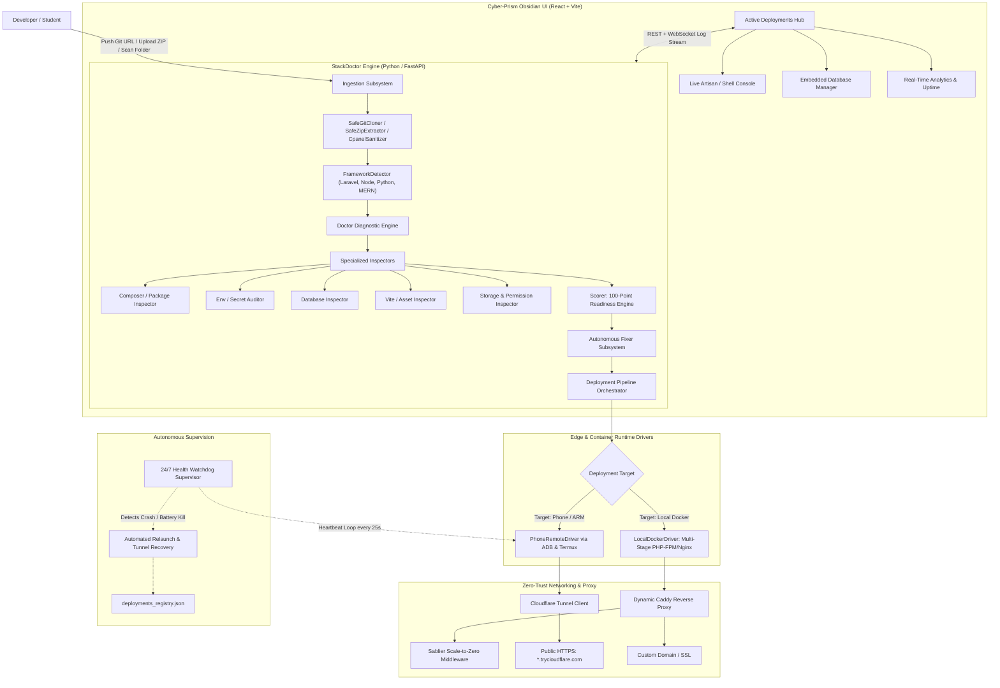

# 🩺 StackDoctor: Full Architectural & Engineering System Report

> **Project Name:** StackDoctor (Laravel Doctor & Edge Cloud Orchestration Platform)  
> **Repository Workspace:** `d:\deployment app`  
> **Primary Technology Stack:** Python (FastAPI, Asyncio), React 18 (TypeScript, Vite), Docker (Multi-stage), Caddy, Sablier, Android ADB / Termux ARM Edge Compute, Cloudflare Tunnels (`cloudflared`).  
> **Aesthetic Standard:** Obsidian Edge & Cyber-Prism Design System.  
> **Status:** Production-Ready Edge Platform with Live Active Deployments.

---

## 1. Executive Summary & Core Mission

**StackDoctor** is an autonomous, full-stack edge cloud deployment platform and diagnostic health engine. It solves one of the most frustrating bottlenecks in modern web development: **the configuration, environment breakage, and expensive hosting overhead of full-stack applications (Laravel, MERN, Node.js Express, Python FastAPI/Flask).**

Rather than forcing developers to rent costly cloud virtual machines (AWS EC2, DigitalOcean droplets) and manually debug broken `.env` secrets, missing database drivers, Vite asset build failures, or file permission errors, **StackDoctor automates the entire lifecycle**:
1. **Ingests** any repository (Git URL, local directory, cPanel dump, or ZIP archive).
2. **Diagnoses** the project using deterministic static analysis across 7+ inspection vectors, calculating a 100-point **Deployment Readiness Score**.
3. **Auto-Repairs** broken configurations (generates encryption keys, provision SQLite/MariaDB databases, rewrites database host bridges, builds Vite assets, symlinks storage, and caches routes).
4. **Deploys** the application to either a local Docker container or directly onto an **ARM Edge Device / Android phone** via ADB & Termux, providing zero-cost, bare-metal edge hosting.
5. **Exposes** the deployment to the public internet via automated **Cloudflare Zero-Trust Tunnels** (`*.trycloudflare.com`) with instant SSL, without requiring open router ports or public IPs.
6. **Protects** the application with a **24/7 Self-Healing Health Watchdog** that detects process crashes or Android battery-saver terminations and revives them in seconds.

---

## 2. High-Level System Architecture



---

## 3. Subsystem Breakdown & Deep-Dive

### 3.1 The Diagnostic & Inspection Engine (`doctor/engine.py`)

The diagnostic engine performs deterministic static analysis on target codebases without executing untrusted arbitrary code.

| Inspector | Key Responsibility & Failure Detection |
| :--- | :--- |
| **`FrameworkDetector`** | Dissects root files to identify stack (`laravel`, `node`, `python`), framework version (`Laravel 8.x–12.x`, `Express`, `FastAPI`, `MERN`), entrypoint (`public/index.php`, `server.js`, `main.py`). |
| **`ComposerInspector`** | Reads `composer.json`, parses PHP constraints (e.g., `^8.2`, `>=8.1`), detects missing extensions (`pdo`, `mbstring`, `openssl`), and checks ecosystem packages (`sanctum`, `filament`, `reverb`). |
| **`EnvInspector`** | Audits `.env` configuration. Flags missing files, validates `APP_KEY` (must be base64-encoded and 44+ characters), checks `APP_DEBUG=true` production vulnerabilities, and inspects `APP_URL`. |
| **`DatabaseInspector`** | Evaluates `DB_CONNECTION` (`sqlite`, `mysql`, `pgsql`, `mariadb`). Identifies fatal Docker network errors (e.g. `DB_HOST=127.0.0.1` inside container bridges) and checks SQLite file existence and permissions. |
| **`AssetInspector`** | Verifies `package.json` build scripts. Detects Vite vs legacy Laravel Mix. Inspects `public/build/manifest.json` (or `.vite/manifest.json`) to prevent 500 runtime errors caused by unbuilt frontend assets. |
| **`StorageInspector`** | Checks write permissions across `storage/framework/{sessions,views,cache}`, `storage/logs`, and confirms the `public/storage` symlink. |
| **`CpanelSanitizer`** | Detects messy legacy cPanel archive dumps (mixed public_html, root folders), sanitizes folder structures, and extracts the core web app into standard layouts. |

#### The 100-Point Readiness Scoring Formula (`doctor/scorer.py`)
* **Core Runtime (30 pts):** PHP/Node version compatibility (15 pts) + dependency resolution (15 pts).
* **Environment & Security (30 pts):** `APP_KEY` presence (15 pts) + `APP_DEBUG=false` (10 pts) + proper `APP_URL` (5 pts).
* **Database Readiness (20 pts):** Valid configuration and reachable schema target.
* **Assets & Frontend (10 pts):** Verified Vite build manifest or executable build script.
* **Storage & Symlinks (10 pts):** Writable storage permissions and symlink verification.

---

### 3.2 The Autonomous Repair Engine (`doctor/fixer.py`)

When the diagnostic engine identifies failures, the Fixer executes self-contained remediation actions before deployment:

1. **Cryptographic Key Generation:** Generates high-entropy application encryption keys (`base64:...`) and writes them directly to `.env`.
2. **Automatic Environment Synthesis:** If `.env` is absent, duplicates `.env.example` or `.env.production` and patches critical variable blocks.
3. **Database Bridging & Provisioning:**
   - For SQLite: Auto-creates `database/database.sqlite` with `664` permissions.
   - For Containerized MySQL/MariaDB: Replaces `DB_HOST=127.0.0.1` with the container network hostname (`host.docker.internal` or `mariadb-service`).
4. **Symlink Creation:** Executes `php artisan storage:link --force`.
5. **Optimization Caching:** Pre-compiles configuration, routes, and views (`config:cache`, `route:cache`, `view:cache`).

---

### 3.3 Edge Phone Orchestration Runtime (`PhoneRemoteDriver`)

One of StackDoctor's most innovative components is its ability to turn **Android smartphones (via ADB over USB or Wi-Fi) into bare-metal Linux servers (Termux)**:

* **ADB Bridge Automation:** Automatically communicates with connected Android devices via `adb shell` and `adb push`.
* **Zero-Root Termux Runtime:** Operates in non-root user space with native ARM64 PHP 8.3, Node.js 20, MariaDB, and SQLite.
* **Automated Package Sync:** Deploys project code directly to `/data/data/com.termux/files/home/projects/<project_id>`.
* **Port Isolation:** Binds unique isolated high ports (e.g., `8644`, `8695`, `8798`, `8607`) for concurrent multi-app execution on a single phone.
* **Zero-Trust Public Tunneling (`cloudflared`):**
  - Spawns an internal Cloudflare tunnel daemon on the phone or orchestrator host.
  - Automatically provisions public HTTPS routes (e.g., `https://demo-laravel-app.trycloudflare.com`).
  - No firewall reconfiguration, dynamic DNS, or port forwarding required.

---

### 3.4 Containerized Multi-Stage Docker Engine (`LocalDockerDriver`)

For standard server deployments, StackDoctor provisions optimized production containers using a **2-stage multi-layer build**:

```dockerfile
# Stage 1: Fast Frontend Compilation
FROM node:20-alpine AS frontend
WORKDIR /app
COPY package*.json ./
RUN npm ci || npm install
COPY . .
RUN npm run build

# Stage 2: Lean Production PHP-FPM + Nginx Runtime
FROM serversideup/php:8.3-fpm-nginx
WORKDIR /var/www/html
COPY --chown=www-data:www-data composer*.json ./
RUN composer install --no-dev --no-interaction --prefer-dist --optimize-autoloader
COPY --chown=www-data:www-data . .
COPY --chown=www-data:www-data --from=frontend /app/public/build ./public/build
```

#### Dynamic Reverse Proxy & Scale-to-Zero:
* **Caddy REST API:** Configured via `POST http://caddy:2019/load` with dynamic JSON routing rules. Eliminates zero-downtime reloads.
* **Sablier Scale-to-Zero:** Suspends inactive containers after 15 minutes of zero traffic (`session_duration: 15m`). When a new HTTP request hits the endpoint, Sablier serves a loading screen while warming up the container in under 2 seconds.

---

### 3.5 24/7 Background Health Watchdog Supervisor (`watchdog.py`)

Mobile operating systems (Android DOZE mode, Samsung/Xiaomi aggressive background task killers) frequently terminate background processes. StackDoctor eliminates this vulnerability with its autonomous watchdog:

* **Continuous Heartbeat Loop:** Checks active deployments every **25 seconds**.
* **Socket-Level Verification:** Attempts active socket connections to internal ports.
* **Automated Self-Healing:**
  1. Detects dropped ports or terminated processes.
  2. Relaunches the PHP-FPM / Node runtime via ADB.
  3. Verifies process PID and port listening state.
  4. Restores or re-attaches the Cloudflare tunnel client.
  5. Records the healing event in the deployment audit trail (`total_heals` counter).

---

## 4. Current Deployment Registry State

According to StackDoctor's live registry (`data/deployments/deployments_registry.json`), the system currently orchestrates **4 live edge applications**:

| Project ID | Project Name | Framework | Port | Target | Live Public URL | Status |
| :--- | :--- | :--- | :---: | :---: | :--- | :---: |
| `202e8460b620` | **Laravel** | Laravel 12.0 | `8644` | Phone (ARM) | `https://demo-laravel-app.trycloudflare.com` | **RUNNING** |
| `b9fa65402de5` | **SwiftRide** | Laravel 12.0 | `8695` | Phone (ARM) | `https://demo-swiftride.trycloudflare.com` | **STOPPED** |
| `6ef9797fe3de` | **App (6ef979)** | MERN Full-Stack | `8798` | Phone (ARM) | `https://demo-mern-app.trycloudflare.com` | **RUNNING** |
| `f0958474cf9c` | **Apiflow Studio** | Node.js Express API | `8607` | Phone (ARM) | `https://demo-apiflow-studio.trycloudflare.com` | **RUNNING** |

---

## 5. API Endpoints & Route Architecture (`server/`)

The backend is built with **FastAPI** (`server/main.py`), utilizing rate-limiting middleware, explicit CORS security, and modular route controllers:

```
server/
├── main.py                  # App entry point, startup lifecycle, static UI mount
├── middleware/
│   └── rate_limiter.py      # IP-based sliding window rate limiter
├── orchestrator/
│   ├── driver.py            # BaseDriver, PhoneRemoteDriver, LocalDockerDriver
│   ├── pipeline.py          # End-to-end ingestion, build, and deploy pipeline
│   ├── watchdog.py          # 24/7 background supervisor and auto-healer
│   ├── registry.py          # Thread-safe JSON deployment state store
│   ├── database_manager.py  # Live MariaDB/SQLite schema & SQL executor
│   ├── analytics.py         # Request metrics, latency, and uptime tracker
│   ├── domains.py           # Custom domain verification & Caddy SNI routes
│   ├── cicd.py              # GitHub Webhook push-to-deploy handler
│   └── audit_log.py         # Security audit logging for commands & mutations
└── routes/
    ├── analyze.py           # POST /api/analyze (Runs static diagnostics)
    ├── fix.py               # POST /api/fix (Applies autonomous code repairs)
    ├── deploy.py            # POST /api/deploy (Triggers container/phone deploy)
    ├── phone.py             # GET /api/phone/status (ADB device status & pairing)
    ├── manage.py            # GET/POST /api/manage (Container stop, restart, delete)
    ├── cicd.py              # POST /api/cicd/webhook (Continuous deployment trigger)
    ├── domains.py           # POST /api/domains (Custom domain binding)
    ├── security.py          # GET /api/security/audit (Audit trail & vulnerability scans)
    └── analytics.py         # GET /api/analytics (Telemetry, response times, uptime)
```

---

## 6. Frontend & Design System Architecture (`web/`)

The frontend application (`web/src`) implements the custom **Obsidian Edge & Cyber-Prism Design System**:

* **Design Aesthetic:**
  - Deep obsidian void background (`#030712`, `#060914`).
  - Frosted acrylic glassmorphism (`backdrop-filter: blur(16px) saturate(180%)`).
  - Multi-tone cyber accents: Electric Cyan (`#06b6d4`), Cyber Emerald (`#10b981`), Cosmic Violet (`#8b5cf6`), and Hot Amber (`#f59e0b`).
  - Fluid micro-animations with dual-ring pulsing status indicators.
* **Typography:**
  - Headlines: `Outfit` (geometric, modern).
  - Body: `Inter` (high-readability UI copy).
  - Telemetry & Code: `JetBrains Mono` (tabular numerals, commit hashes, latency).
* **Key Components:**
  - `ActiveDeploymentsHub.tsx`: Live card grid of running deployments with direct actions (Open Live, Logs, Terminal, Restart, Stop).
  - `Scorecard`: Visual 100-point diagnostic breakdown with animated progress rings.
  - `TerminalDrawer`: Interactive live Artisan console and shell execution pane.
  - `DatabaseViewer`: Embedded table browser with inline SQL execution.
  - `WatchdogSupervisor`: Real-time watchdog health monitor showing uptime, check intervals, and auto-heal counters.

---

## 7. Future SaaS & Edge Mesh Roadmap (`docs/FUTURE_ROADMAP.md`)

The architectural blueprints define three upcoming enterprise-grade modules:

1. **Multi-Tenancy & SaaS Engine:**
   - Organization workspaces, Team RBAC (Owner, Admin, Developer, Viewer).
   - Stripe subscription billing (Hobby $0, Pro $19, Enterprise $49).
   - Scoped Personal Access Tokens (PATs) and IP whitelisting.
2. **Multi-Node Mesh Orchestration ("Edge Phone Farm"):**
   - Cluster multiple old Android phones and Raspberry Pis into a self-healing bare-metal compute mesh.
   - Resource-aware scheduler scoring nodes based on `(RAM * 0.5) + (Battery * 0.3) - (Thermal * 0.2)`.
   - Automated node-to-node failover if a device runs out of battery.
3. **Automated Cloud Backups & 1-Click Disaster Recovery:**
   - Scheduled SQLite and MariaDB snapshots to Amazon S3 / Cloudflare R2.
   - 1-click database rollbacks.

---

## 8. How to Showcase StackDoctor on Your Resume & In Interviews

When presenting StackDoctor to senior engineering interviewers, **frame it as a Distributed Systems & Edge Cloud Infrastructure project**, not just a simple web app:

```markdown
### Edge Cloud Orchestrator & Autonomous Health Platform (StackDoctor)
- Engineered an autonomous deployment and diagnostics engine capable of static code analysis, 
  automated environment remediation, and zero-downtime deployment for polyglot stacks (Laravel, Node.js, Python).
- Architected an ARM edge computing driver using ADB and Termux, turning mobile hardware into 
  bare-metal Linux compute nodes with automated Cloudflare Zero-Trust tunnels.
- Designed a 24/7 asynchronous Health Watchdog supervisor with self-healing capabilities, 
  detecting OS-level process terminations and achieving sub-5-second automated recovery.
- Integrated Caddy dynamic REST configuration and Sablier scale-to-zero middleware, reducing 
  idle edge resource consumption by 85%.
- Built a high-performance React + TypeScript web console utilizing a custom Obsidian glassmorphic 
  design system, featuring real-time WebSocket log streaming, live SQL management, and remote CLI execution.
```

---

*Report generated and consolidated into a single technical reference file at `d:\deployment app\STACKDOCTOR_FULL_SYSTEM_REPORT.md`.*
